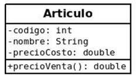

# Clase Artículo

>### Dado el siguiente  **diagrama de clases**. 

>

>### Para este ejercicio se pide desarrollar la clase **Articulo** respetando el diagrama, es decir, NO pueden agregar nuevos atributos.
• **Escriba los métodos constructores, getter y setter**

• **public double precioVenta():** El método devuelve el valor de precioCosto con un incremento del 30%.

• **public String toString():** Devuelve transformado en String: código, nombre, precioCosto y precioVenta() del producto.

En la clase **Principal** deberá crear dos objetos de tipo Articulo, uno con todos los valores cargados con el constructor específico, otro con los métodos setters. Puede cargar los atributos con valores constantes, tal como se realizó en el teórico.

### ATENCIÓN: No olvide compartir el link a su proyecto en CREA para poder corregir.
Link en replit: https://replit.com/@utu_liceo/ESCRITO2-2022#README.md
